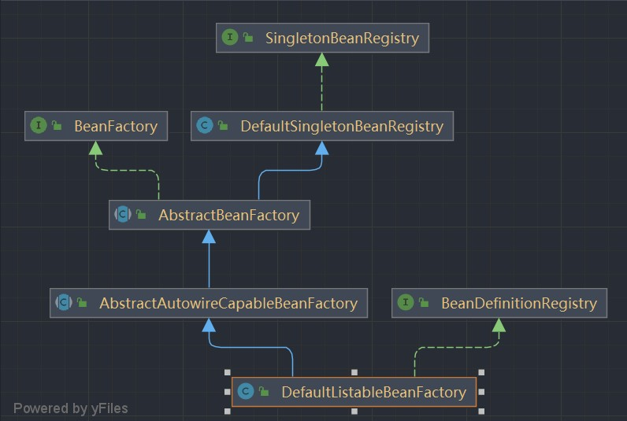

# Ioc

## 简单的git指令

1. 创建新分支

   ```cobol
    git branch simple-bean-container
   ```

2. 切换分支

   ```cobol
   git checkout simple-bean-container
   ```

3. 加载全部文件

   ```cobol
   git add .
   ```

4. 提交到仓库

   ```cobol
   git commit -m "提交的信息"
   ```

5. 推送

   ```cobol
   git push --set-upstream origin 分支名称
   got push(主分支)
   ```

6. 合并分支

   首先切换到要合并的分支上

   ```cobol
   git merge 需要合并的分支
   ```

 ## 最简单的bean容器

 > 分支：simple-bean-container

1. 创建一个简单的BeanFactory工厂类，用于管理bean，只有注册bean和获取bean两个成员方法

   ```java
   /**
    * 一个简单的bean工厂
    */
   public class BeanFactory {
       // 简单的 map 集合 管理 bean
       private final Map<String, Object> beanMap = new HashMap<>();
   
       /**
        * 注册bean
        *
        * @param beanName bean的名称
        * @param bean     bean对象
        */
       public void registerBean(String beanName, Object bean) {
           beanMap.put(beanName, bean);
       }
   
       /**
        * 根据bean名称获取bean
        *
        * @param beanName bean的名称
        * @return bean对象
        */
       public Object getBean(String beanName) {
           return beanMap.get(beanName);
       }
   }
   ```

2. 创建一个test类，用于测试BeanFactory对象是否可以正常工作

   ```java
   public class SimpleBeanContainerTest {
       @Test
       public void testGetBean() {
           // 1、获取BeanFactory对象
           BeanFactory beanFactory = new BeanFactory();
           // 2、注册bean、
           beanFactory.registerBean("helloService", new HelloService());
           // 3、获取bean对象
           HelloService helloService = (HelloService) beanFactory.getBean("helloService");
           // 4、使用bean对象的成员方法
           helloService.sayHello();
       }
   
       static class HelloService {
           public void sayHello() {
               System.out.println("hello spring");
           }
       }
   }
   ```

## BeanDefinition和BeanDefinitionRegistry

> 分支：bean-definition-and-bean-definition-registry

类层次结构图



**运行流程**

首先需要获取工厂对象（DefaultListableBeanFactory），然后将要管理的bean先使用BeanDefinitionRegistry接口的registryBean方法注册。注册好后并不代表工厂类就有该bean类，当该bean第一次被调用时会在工厂中进行寻找，如果不存在，通过beanDefinnition获取bean的Class，然后使用反射创建出该bean，再返回给工厂，这样可以提高bean工厂的效率

- SimletonBeanRegistry接口：单例bean的注册接口，只有一个获取单例bean的成员方法

  ```java
  /**
   * 单例bean的注册接口
   */
  public interface SimpletonBeanRegistry {
      /**
       * 获取单例bean
       *
       * @param beanName bean名称
       * @return 单例bean
       */
      Object getSingleton(String beanName);
  }
  ```

- DefaultSingletonRegistry类：用于管理单例bean，是一个单例bean的工厂

  ```java
  public class DefaultSimpletonBeanRegistry implements SimpletonBeanRegistry {
      // 管理单例bean的map集合
      private final Map<String, Object> simpletonBeanMap = new HashMap<>();
  
      /**
       * 获取单例bean
       *
       * @param beanName bean名称
       * @return 单例bean
       */
      @Override
      public Object getSingleton(String beanName) {
          return simpletonBeanMap.get(beanName);
      }
  
      /**
       * 添加单例bean
       *
       * @param simpletonBeanName 单例bean名称
       * @param simpletonBean     单例bean对象
       */
      public void addSimpleton(String simpletonBeanName, Object simpletonBean) {
          simpletonBeanMap.put(simpletonBeanName, simpletonBean);
      }
  }
  ```

- BeanFactory接口：只有一个获取bean的成员方法

  ```java
  /**
   * bean工厂
   */
  public interface BeanFactory {
      /**
       * 根据bean名称获取bean
       *
       * @param name bean名称
       * @return bean对象
       */
      Object getBean(String name);
  }
  ```

- AbstractBeanFactory抽象类：实现了BeanFactory的getBean方法，首先获取单例bean，如果没有则创建一个单例bean

  ```java
  public abstract class AbstractBeanFactory extends DefaultSimpletonBeanRegistry implements BeanFactory {
      @Override
      public Object getBean(String beanName) {
          // 获取单例bean
          Object bean = getSingleton(beanName);
          // 不为null则返回
          if (bean != null) return bean;
          // 不存在单例bean则创建
          BeanDefinition beanDefinition = getBeanDefinition(beanName);
          return createBean(beanName, beanDefinition);
      }
  
      /**
       * 创建bean
       *
       * @param beanName       bean名称
       * @param beanDefinition 定义bean的对象
       * @return 创建好的bean
       * @throws BeansException 未找到bean
       */
      public abstract Object createBean(String beanName, BeanDefinition beanDefinition) throws BeansException;
  
      /**
       * 获取定义bean的对象
       *
       * @param beanName bean名称
       * @return 定义bean的对象
       * @throws BeansException 未找到bean
       */
      public abstract BeanDefinition getBeanDefinition(String beanName) throws BeansException;
  }
  ```

- AbstractAutowireCapableBeanFactory抽象类：通过反射实现创建单例bean的方法

  ```java
  public abstract class AbstractAutowireCapableBeanFactory extends AbstractBeanFactory {
      @Override
      public Object createBean(String beanName, BeanDefinition beanDefinition) throws BeansException {
          return doCreateBean(beanName, beanDefinition);
      }
  
      public Object doCreateBean(String beanName, BeanDefinition beanDefinition) {
          // 根据定义bean的对象，获取bean的Class类型
          Class beanClass = beanDefinition.getBeanClass();
          Object bean = null;
          try {
              // 通过反射创建出bean
              bean = beanClass.newInstance();
          } catch (Exception e) {
              throw new BeansException("Instantiation of bean failed", e);
          }
  
          // 添加至单例bean
          addSimpleton(beanName, bean);
          return bean;
      }
  }
  ```

- BeanDefinition类：用于定义bean的信息，包括bean的Class信息、成员属性、scope等，这里简化只有bean的Class信息

  ```java
  /**
   * 定义一个bean所需的属性类
   */
  public class BeanDefinition {
      private Class beanClass;
  
      public BeanDefinition(Class beanClass) {
          this.beanClass = beanClass;
      }
  
      public Class getBeanClass() {
          return beanClass;
      }
  
      public void setBeanClass(Class beanClass) {
          this.beanClass = beanClass;
      }
  }
  ```

- BeanDefinitionRegistry接口：Beandefinition类的注册接口

  ```java
  /**
   * 定义bean的接口
   */
  public interface BeanDefinitionRegistry {
      /**
       * 注册bean
       *
       * @param beanName       bean的名称
       * @param beanDefinition bean的属性类
       */
      void registryBean(String beanName, BeanDefinition beanDefinition);
  }
  ```

- DefaultListableBeanFactory类：拥有beanDefinition对象，管理所有bean的BeanDefinition，同时它是最高层类，也拥有管理单例bean的功能

  ```java
  public class DefaultListableBeanFactory extends AbstractAutowireCapableBeanFactory implements BeanDefinitionRegistry {
      private final Map<String, BeanDefinition> beanDefinitionMap = new HashMap<>();
  
      @Override
      public BeanDefinition getBeanDefinition(String beanName) throws BeansException {
          BeanDefinition beanDefinition = beanDefinitionMap.get(beanName);
          if (beanDefinition == null)
              throw new BeansException("No bean named '" + beanName + "' is defined");
          return beanDefinition;
      }
  
      @Override
      public void registryBean(String beanName, BeanDefinition beanDefinition) {
          beanDefinitionMap.put(beanName, beanDefinition);
      }
  }
  ```

**测试**

```java
public class BeanDefinitionAndBeanDefinitionRegistryTest {
    @Test
    public void testGetBean() {
        // 1、创建bean工厂
        DefaultListableBeanFactory beanFactory = new DefaultListableBeanFactory();
        // 2、获取注册bean的class属性
        BeanDefinition beanDefinition = new BeanDefinition(HelloService.class);
        // 3、注册bean
        beanFactory.registryBean("helloService", beanDefinition);
        // 4、使用bean
        HelloService helloService = (HelloService) beanFactory.getBean("helloService");
        helloService.sayHello();
    }
}

// 重新定义一个类
public class HelloService {
    public void sayHello() {
        System.out.println("hello spring");
    }
}
```

