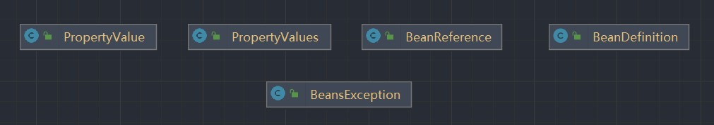

# Ioc

## 简单的git指令

1. 创建新分支

   ```cobol
    git branch simple-bean-container
   ```

2. 切换分支

   ```cobol
   git checkout simple-bean-container
   ```

3. 加载全部文件

   ```cobol
   git add .
   ```

4. 提交到仓库

   ```cobol
   git commit -m "提交的信息"
   ```

5. 推送

   ```cobol
   git push --set-upstream origin 分支名称
   got push(主分支)
   ```

6. 合并分支

   首先切换到要合并的分支上

   ```cobol
   git merge 需要合并的分支
   ```

 ## 最简单的bean容器

 > 分支：simple-bean-container

1. 创建一个简单的BeanFactory工厂类，用于管理bean，只有注册bean和获取bean两个成员方法

   ```java
   /**
    * 一个简单的bean工厂
    */
   public class BeanFactory {
       // 简单的 map 集合 管理 bean
       private final Map<String, Object> beanMap = new HashMap<>();
   
       /**
        * 注册bean
        *
        * @param beanName bean的名称
        * @param bean     bean对象
        */
       public void registerBean(String beanName, Object bean) {
           beanMap.put(beanName, bean);
       }
   
       /**
        * 根据bean名称获取bean
        *
        * @param beanName bean的名称
        * @return bean对象
        */
       public Object getBean(String beanName) {
           return beanMap.get(beanName);
       }
   }
   ```

2. 创建一个test类，用于测试BeanFactory对象是否可以正常工作

   ```java
   public class SimpleBeanContainerTest {
       @Test
       public void testGetBean() {
           // 1、获取BeanFactory对象
           BeanFactory beanFactory = new BeanFactory();
           // 2、注册bean、
           beanFactory.registerBean("helloService", new HelloService());
           // 3、获取bean对象
           HelloService helloService = (HelloService) beanFactory.getBean("helloService");
           // 4、使用bean对象的成员方法
           helloService.sayHello();
       }
   
       static class HelloService {
           public void sayHello() {
               System.out.println("hello spring");
           }
       }
   }
   ```

## BeanDefinition和BeanDefinitionRegistry

> 分支：bean-definition-and-bean-definition-registry

类层次结构图


**运行流程**

首先需要获取工厂对象（DefaultListableBeanFactory），然后将要管理的bean先使用BeanDefinitionRegistry接口的registryBean方法注册。注册好后并不代表工厂类就有该bean类，当该bean第一次被调用时会在工厂中进行寻找，如果不存在，通过beanDefinnition获取bean的Class，然后使用反射创建出该bean，再返回给工厂，这样可以提高bean工厂的效率

- SimletonBeanRegistry接口：单例bean的注册接口，只有一个获取单例bean的成员方法

  ```java
  /**
   * 单例bean的注册接口
   */
  public interface SimpletonBeanRegistry {
      /**
       * 获取单例bean
       *
       * @param beanName bean名称
       * @return 单例bean
       */
      Object getSingleton(String beanName);
  }
  ```

- DefaultSingletonRegistry类：用于管理单例bean，是一个单例bean的工厂

  ```java
  public class DefaultSimpletonBeanRegistry implements SimpletonBeanRegistry {
      // 管理单例bean的map集合
      private final Map<String, Object> simpletonBeanMap = new HashMap<>();
  
      /**
       * 获取单例bean
       *
       * @param beanName bean名称
       * @return 单例bean
       */
      @Override
      public Object getSingleton(String beanName) {
          return simpletonBeanMap.get(beanName);
      }
  
      /**
       * 添加单例bean
       *
       * @param simpletonBeanName 单例bean名称
       * @param simpletonBean     单例bean对象
       */
      public void addSimpleton(String simpletonBeanName, Object simpletonBean) {
          simpletonBeanMap.put(simpletonBeanName, simpletonBean);
      }
  }
  ```

- BeanFactory接口：只有一个获取bean的成员方法

  ```java
  /**
   * bean工厂
   */
  public interface BeanFactory {
      /**
       * 根据bean名称获取bean
       *
       * @param name bean名称
       * @return bean对象
       */
      Object getBean(String name);
  }
  ```

- AbstractBeanFactory抽象类：实现了BeanFactory的getBean方法，首先获取单例bean，如果没有则创建一个单例bean

  ```java
  public abstract class AbstractBeanFactory extends DefaultSimpletonBeanRegistry implements BeanFactory {
      @Override
      public Object getBean(String beanName) {
          // 获取单例bean
          Object bean = getSingleton(beanName);
          // 不为null则返回
          if (bean != null) return bean;
          // 不存在单例bean则创建
          BeanDefinition beanDefinition = getBeanDefinition(beanName);
          return createBean(beanName, beanDefinition);
      }
  
      /**
       * 创建bean
       *
       * @param beanName       bean名称
       * @param beanDefinition 定义bean的对象
       * @return 创建好的bean
       * @throws BeansException 未找到bean
       */
      public abstract Object createBean(String beanName, BeanDefinition beanDefinition) throws BeansException;
  
      /**
       * 获取定义bean的对象
       *
       * @param beanName bean名称
       * @return 定义bean的对象
       * @throws BeansException 未找到bean
       */
      public abstract BeanDefinition getBeanDefinition(String beanName) throws BeansException;
  }
  ```

- AbstractAutowireCapableBeanFactory抽象类：通过反射实现创建单例bean的方法

  ```java
  public abstract class AbstractAutowireCapableBeanFactory extends AbstractBeanFactory {
      @Override
      public Object createBean(String beanName, BeanDefinition beanDefinition) throws BeansException {
          return doCreateBean(beanName, beanDefinition);
      }
  
      public Object doCreateBean(String beanName, BeanDefinition beanDefinition) {
          // 根据定义bean的对象，获取bean的Class类型
          Class beanClass = beanDefinition.getBeanClass();
          Object bean = null;
          try {
              // 通过反射创建出bean
              bean = beanClass.newInstance();
          } catch (Exception e) {
              throw new BeansException("Instantiation of bean failed", e);
          }
  
          // 添加至单例bean
          addSimpleton(beanName, bean);
          return bean;
      }
  }
  ```

- BeanDefinition类：用于定义bean的信息，包括bean的Class信息、成员属性、scope等，这里简化只有bean的Class信息

  ```java
  /**
   * 定义一个bean所需的属性类
   */
  public class BeanDefinition {
      private Class beanClass;
  
      public BeanDefinition(Class beanClass) {
          this.beanClass = beanClass;
      }
  
      public Class getBeanClass() {
          return beanClass;
      }
  
      public void setBeanClass(Class beanClass) {
          this.beanClass = beanClass;
      }
  }
  ```

- BeanDefinitionRegistry接口：Beandefinition类的注册接口

  ```java
  /**
   * 定义bean的接口
   */
  public interface BeanDefinitionRegistry {
      /**
       * 注册bean
       *
       * @param beanName       bean的名称
       * @param beanDefinition bean的属性类
       */
      void registryBean(String beanName, BeanDefinition beanDefinition);
  }
  ```

- DefaultListableBeanFactory类：拥有beanDefinition对象，管理所有bean的BeanDefinition，同时它是最高层类，也拥有管理单例bean的功能

  ```java
  public class DefaultListableBeanFactory extends AbstractAutowireCapableBeanFactory implements BeanDefinitionRegistry {
      private final Map<String, BeanDefinition> beanDefinitionMap = new HashMap<>();
  
      @Override
      public BeanDefinition getBeanDefinition(String beanName) throws BeansException {
          BeanDefinition beanDefinition = beanDefinitionMap.get(beanName);
          if (beanDefinition == null)
              throw new BeansException("No bean named '" + beanName + "' is defined");
          return beanDefinition;
      }
  
      @Override
      public void registryBean(String beanName, BeanDefinition beanDefinition) {
          beanDefinitionMap.put(beanName, beanDefinition);
      }
  }
  ```

**测试**

```java
public class BeanDefinitionAndBeanDefinitionRegistryTest {
    @Test
    public void testGetBean() {
        // 1、创建bean工厂
        DefaultListableBeanFactory beanFactory = new DefaultListableBeanFactory();
        // 2、获取注册bean的class属性
        BeanDefinition beanDefinition = new BeanDefinition(HelloService.class);
        // 3、注册bean
        beanFactory.registryBean("helloService", beanDefinition);
        // 4、使用bean
        HelloService helloService = (HelloService) beanFactory.getBean("helloService");
        helloService.sayHello();
    }
}

// 重新定义一个类
public class HelloService {
    public void sayHello() {
        System.out.println("hello spring");
    }
}
```

## Bean实例化策略InstantiationStrategy

> 代码分支：instantiation-strategy

现在bean是在AbstractAutowireCapableBeanFactory.doCreateBean方法中用beanClass.newInstance()来实例化，仅适用于bean有无参构造函数的情况。


- InstantiationStrategy接口：有一个实例化bean的成员方法

  ```java
  public interface InstantiationStrategy {
      Object instantiate(BeanDefinition beanDefinition) throws BeansException;
  }
  ```

针对bean的实例化，抽象出一个实例化策略的接口InstantiationStrategy，有两个实现类：

- SimpleInstantiationStrategy，使用bean的构造函数来实例化

  ```java
  public class SimpleInstantiationStrategy implements InstantiationStrategy {
      @Override
      public Object instantiate(BeanDefinition beanDefinition) throws BeansException {
          Class beanClass = beanDefinition.getBeanClass();
          Object bean = null;
          try {
              Constructor constructor = beanClass.getConstructor();
              bean = constructor.newInstance();
          } catch (Exception e) {
              throw new BeansException("Failed to instantiate [" + beanClass.getName() + "]", e);
          }
          return bean;
      }
  }
  ```

- CglibSubclassingInstantiationStrategy，使用CGLIB动态生成子类

  CGLIB可以在运行时动态生成子类，对父类进行扩展，从而实现代理的功能。与Java原生的动态代理相比，CGLIB可以代理没有实现接口的类，而且性能更高

  ```java
  /**
   * 使用CGLIB动态生成子类
   */
  public class CglibSubclassingInstantiationStrategy implements InstantiationStrategy {
  
      /**
       * 使用CGLIB动态生成bean的代理类
       *
       * @param beanDefinition 定义bean的对象
       * @return bean对象
       * @throws BeansException 创建bean异常
       */
      @Override
      public Object instantiate(BeanDefinition beanDefinition) throws BeansException {
          // 创建一个Enhancer对象，Enhancer是CGLIB中的一个类，用于生成代理类的实例
          Enhancer enhancer = new Enhancer();
          // 设置Enhancer对象的父类为beanDefinition中的beanClass，即要代理的类
          enhancer.setSuperclass(beanDefinition.getBeanClass());
          // 设置Enhancer对象的回调函数，回调函数是一个MethodInterceptor对象，用于在代理对象执行方法时拦截并处理方法调用
          enhancer.setCallback((MethodInterceptor) (obj, method, argsTemp, proxy) -> proxy.invokeSuper(obj, argsTemp));
          // 调用Enhancer对象的create()方法生成代理对象并返回
          return enhancer.create();
      }
  }
  ```

## 为bean填充属性

> 分支：populate-bean-with-property-values

在BeanDefinition中增加和bean属性对应的PropertyValues，实例化bean之后，为bean填充属性(AbstractAutowireCapableBeanFactory#applyPropertyValues)。

- PropertyValue类：bean的单个属性

  ```java
  /**
   * bean的单个属性
   */
  public class PropertyValue {
      private String name;
      private Object value;
  
      public PropertyValue(String name, Object value) {
          this.name = name;
          this.value = value;
      }
  
      public String getName() {
          return name;
      }
  
      public void setName(String name) {
          this.name = name;
      }
  
      public Object getValue() {
          return value;
      }
  
      public void setValue(Object value) {
          this.value = value;
      }
  }
  ```

- PropertyValues类：bean的属性集合

  ```java
  /**
   * bean的属性集合
   */
  public class PropertyValues {
      List<PropertyValue> propertyValueList = new ArrayList<>();
  
      /**
       * 添加bean的属性
       *
       * @param pv bean的属性
       */
      public void addPropertyValue(PropertyValue pv) {
          propertyValueList.add(pv);
      }
  
      /**
       * 获取bean的属性集合
       *
       * @return propertyValueList的array
       */
      public PropertyValue[] getPropertyValues() {
          return propertyValueList.toArray(new PropertyValue[0]);
      }
  
      /**
       * 获取根据属性名称单个属性
       *
       * @param name 属性名称
       * @return 单个属性
       */
      public PropertyValue getPropertyValue(String name) {
          for (PropertyValue currentPropertyValue : propertyValueList) {
              if (currentPropertyValue.getName().equals(name)) return currentPropertyValue;
          }
          return null;
      }
  }
  ```

- AbstractAutowireCapableBeanFactory#applyPropertyValues

  ```java
  /**
   * 为bean添加属性
   *
   * @param beanName       bean名称
   * @param bean           bean对象
   * @param beanDefinition 定义bean的对象
   */
  public void applyPropertyValues(String beanName, Object bean, BeanDefinition beanDefinition) {
      PropertyValue[] propertyValues = beanDefinition.getPropertyValues().getPropertyValues();
      for (PropertyValue propertyValue : propertyValues) {
          String name = propertyValue.getName();
          Object value = propertyValue.getValue();
  
          // 使用反射添加属性
          BeanUtil.setFieldValue(bean, name, value);
      }
  }
  
  public Object doCreateBean(String beanName, BeanDefinition beanDefinition) {
      Object bean = null;
      try {
          bean = createBeanInstance(beanDefinition);
          // 添加属性
          applyPropertyValues(beanName, bean, beanDefinition);
      } catch (Exception e) {
          throw new BeansException("Instantiation of bean failed", e);
      }
  
      // 添加至单例bean
      addSimpleton(beanName, bean);
      return bean;
  }
  ```

**测试**

```java
public class PopulateBeanWithPropertyValuesTest {
    @Test
    public void testPopulateBeanWithPropertyValues() {
        // 1、获得beanFactory对象
        DefaultListableBeanFactory defaultListableBeanFactory = new DefaultListableBeanFactory();
        // 2、定义bean的属性集合
        PropertyValues propertyValues = new PropertyValues();
        // 3、为bean的属性集合添加属性
        propertyValues.addPropertyValue(new PropertyValue("name", "张三"));
        propertyValues.addPropertyValue(new PropertyValue("age", 18));
        // 4、创建定义bean的对象
        BeanDefinition beanDefinition = new BeanDefinition(Person.class, propertyValues);
        // 5、注册定义bean的对象
        defaultListableBeanFactory.registryBeanDefinition("Person", beanDefinition);
        // 6、获取工厂里面的bean对象
        Person person = (Person) defaultListableBeanFactory.getBean("Person");
        // 7、使用bean
        System.out.println(person);
        assertThat(person.getName()).isEqualTo("张三");
        assertThat(person.getAge()).isEqualTo(18);
    }
}
```

## 为bean注入bean

> 分支：populate-bean-with-bean

增加BeanReference类，包装一个bean对另一个bean的引用。实例化beanA后填充属性时，若PropertyValue#value为BeanReference，引用beanB，则先去实例化beanB。？》、。
由于不想增加代码的复杂度提高理解难度，暂时不支持循环依赖，后面会在高级篇中解决该问题。

```java
protected void applyPropertyValues(String beanName, Object bean, BeanDefinition beanDefinition) {
    try {
        for (PropertyValue propertyValue : beanDefinition.getPropertyValues().getPropertyValues()) {
            String name = propertyValue.getName();
            Object value = propertyValue.getValue();
            if (value instanceof BeanReference) {
                // beanA依赖beanB，先实例化beanB
                BeanReference beanReference = (BeanReference) value;
                value = getBean(beanReference.getBeanName());
            }

            //通过反射设置属性
            BeanUtil.setFieldValue(bean, name, value);
        }
    } catch (Exception ex) {
        throw new BeansException("Error setting property values for bean: " + beanName, ex);
    }
}
```

**测试**

```java
public class PopulateBeanWithPropertyValuesTest {

	/**
	 * 为bean注入bean
	 *
	 * @throws Exception
	 */
	@Test
	public void testPopulateBeanWithBean() throws Exception {
		DefaultListableBeanFactory beanFactory = new DefaultListableBeanFactory();

		//注册Car实例
		PropertyValues propertyValuesForCar = new PropertyValues();
		propertyValuesForCar.addPropertyValue(new PropertyValue("brand", "porsche"));
		BeanDefinition carBeanDefinition = new BeanDefinition(Car.class, propertyValuesForCar);
		beanFactory.registerBeanDefinition("car", carBeanDefinition);

		//注册Person实例
		PropertyValues propertyValuesForPerson = new PropertyValues();
		propertyValuesForPerson.addPropertyValue(new PropertyValue("name", "derek"));
		propertyValuesForPerson.addPropertyValue(new PropertyValue("age", 18));
		//Person实例依赖Car实例
		propertyValuesForPerson.addPropertyValue(new PropertyValue("car", new BeanReference("car")));
		BeanDefinition beanDefinition = new BeanDefinition(Person.class, propertyValuesForPerson);
		beanFactory.registerBeanDefinition("person", beanDefinition);

		Person person = (Person) beanFactory.getBean("person");
		System.out.println(person);
		assertThat(person.getName()).isEqualTo("derek");
		assertThat(person.getAge()).isEqualTo(18);
		Car car = person.getCar();
		assertThat(car).isNotNull();
		assertThat(car.getBrand()).isEqualTo("porsche");
	}
}
```

## 资源和资源加载器

> 分支：resource-and-resource-loader

Resource是资源的抽象和访问接口，简单写了三个实现类


- Resource，资源的抽象和访问接口

  ```java
  /**
   * 资源的抽象和访问接口
   */
  public interface Resource {
  
      /**
       * 获取资源文件的输入流
       *
       * @return 输入流
       * @throws IOException IO异常
       */
      InputStream getInputStream() throws IOException;
  }
  ```

- FileSystemResource，文件系统资源的实现类

  ```java
  /**
   * 文件系统资源的实现类
   */
  public class FileSystemResource implements Resource {
      private final String filePath;
  
      public FileSystemResource(String filePath) {
          this.filePath = filePath;
      }
  
      @Override
      public InputStream getInputStream() throws IOException {
          try {
              Path path = new File(filePath).toPath();
              return Files.newInputStream(path);
          } catch (NoSuchFileException ex) {
              throw new FileNotFoundException(ex.getMessage());
          }
      }
  }
  ```

- ClassPathResource，classpath下资源的实现类

  ```java
  /**
   * classpath下资源的实现类
   */
  public class ClassPathResource implements Resource {
      private final String path;
  
      public ClassPathResource(String path) {
          this.path = path;
      }
  
      /**
       * 从当前类所在的类加载器中获取指定路径下的资源文件，并返回一个输入流
       * 1、this.getClass() 获取当前类的 Class 对象
       * 2、getClassLoader() 获取当前类的类加载器（加载resources目录）
       * 3、getResourceAsStream(this.path) 获取指定路径下的资源文件，并返回一个输入流。其中，this.path
       * 是一个字符串类型的参数，表示需要获取的资源文件的路径。这个路径可以是相对于当前类所在的包的相对路径
       * 也可以是以“/”开头的绝对路径。如果资源文件不存在，将返回 null
       *
       * @return 资源文件的输入流
       * @throws IOException IO异常
       */
      @Override
      public InputStream getInputStream() throws IOException {
          InputStream is = this.getClass().getClassLoader().getResourceAsStream(this.path);
          if (is == null) {
              throw new FileNotFoundException(this.path + " cannot be opened because it does not exist");
          }
          return is;
      }
  }
  ```

  Spring中获取当前类的类加载器会读取resources目录下的文件。在Spring中，可以通过以下方式获取当前类的类加载器：

  1. 使用Thread.currentThread().getContextClassLoader()方法获取当前线程的上下文类加载器；
  2. 使用当前类的getClassLoader()方法获取当前类的类加载器。

  无论是哪种方式，都会读取classpath下的资源文件，包括resources目录下的文件。因此，在Spring中，可以将需要读取的配置文件放在resources目录下，然后使用上述方式获取类加载器并加载配置文件。

- UrlResource，对java.net.URL进行资源定位的实现类

  ```java
  /**
   * 对java.net.URL进行资源定位的实现类
   */
  public class UrlResource implements Resource {
      private final URL url;
  
      public UrlResource(URL url) {
          this.url = url;
      }
  
      /**
       * 使用 URL 类的 openConnection() 方法打开一个网络连接，并获取该连接的输入流
       *
       * @return URL连接的输入流
       * @throws IOException IO异常
       */
      @Override
      public InputStream getInputStream() throws IOException {
          URLConnection con = url.openConnection();
          try {
              return con.getInputStream();
          } catch (IOException ex) {
              throw ex;
          }
      }
  }
  ```

- ResourceLoader接口则是资源查找定位策略的抽象

  ```java
  /**
   * 资源查找定位策略的抽象
   */
  public interface ResourceLoader {
      /**
       * 获取资源接口的实现类，从而获取InputStream
       *
       * @param location 资源路径
       * @return 资源实现类
       */
      Resource getResource(String location);
  }
  ```

- DefaultResourceLoader是其默认实现类

  ```java
  public class DefaultResourceLoader implements ResourceLoader {
      private final String CLASSPATH_URL_PREFIX = "classpath:";
  
      @Override
      public Resource getResource(String location) {
          if (location.startsWith(CLASSPATH_URL_PREFIX)) {
              // 首先从classpath查找资源
              return new ClassPathResource(location.substring(CLASSPATH_URL_PREFIX.length()));
          } else {
              try {
                  // 从URL资源中查找
                  URL url = new URL(location);
                  return new UrlResource(url);
              } catch (MalformedURLException ex) {
                  // 从系统资源中查找
                  return new FileSystemResource(location);
              }
          }
      }
  }
  ```

**测试**

```java
public class ResourceAndResourceLoaderTest {
    @Test
    public void testResourceAndResourceLoader() throws IOException {
        DefaultResourceLoader resourceLoader = new DefaultResourceLoader();

        // 加载classpath下的资源
        String classPath = "classpath:hello.txt";
        Resource resource = resourceLoader.getResource(classPath);
        InputStream inputStream = resource.getInputStream();
        String str = IoUtil.readUtf8(inputStream);
        System.out.println(str);

        // 加载URL资源文件
        String url = "https://www.baidu.com";
        resource = resourceLoader.getResource(url);
        inputStream = resource.getInputStream();
        str = IoUtil.readUtf8(inputStream);
        System.out.println(str);

        // 加载系统资源文件
        String filePath = "src/test/resources/hello.txt";
        resource = resourceLoader.getResource(filePath);
        inputStream = resource.getInputStream();
        str = IoUtil.readUtf8(inputStream);
        System.out.println(str);
    }
}
```

## 在xml文件中定义bean

> 分支：xml-file-define-bean

有了资源加载器，就可以在xml格式配置文件中声明式地定义bean的信息，资源加载器读取xml文件，解析出bean的信息，然后往容器中注册BeanDefinition。

BeanDefinitionReader是读取bean定义信息的抽象接口，XmlBeanDefinitionReader是从xml文件中读取的实现类。BeanDefinitionReader需要有获取资源的能力，且读取bean定义信息后需要往容器中注册BeanDefinition，因此BeanDefinitionReader的抽象实现类AbstractBeanDefinitionReader拥有ResourceLoader和BeanDefinitionRegistry两个属性。

由于从xml文件中读取的内容是String类型，所以属性仅支持String类型和引用其他Bean。后面会讲到属性编辑器PropertyEditor，实现类型转换。

为了方便后面的讲解和功能实现，并且尽量保持和spring中BeanFactory的继承层次一致，对BeanFactory的继承层次稍微做了调整。


BeanFactory以及它的拓展接口，每一个Factory接口都对BeanFactory的功能进行了拓展


Bean工厂整体类图


读取xml配置文件的类图


与定义bean有关的类图



- BeanFactory新增，在AbstractBeanFactory中实现

  ```java
  /**
   * 根据名称和类型获取bean
   *
   * @param name         bean的名称
   * @param requiredType bean的类型
   * @param <T>          bean的类型
   * @return bean
   */
  <T> T getBean(String name, Class<T> requiredType);
  ```

  ```java
  /**
   * @param name
   * @param requiredType
   * @param <T>
   * @return
   */
  @Override
  public <T> T getBean(String name, Class<T> requiredType) {
      return ((T) getBean(name));
  }
  ```

- BeanDefinitionRegistry新增，在DefaultListableBeanFactory中实现

  ```java
  /**
   * 获取beanDefinition
   *
   * @param beanName bean名称
   * @return beanDefinition
   * @throws BeansException 未找到bean
   */
  BeanDefinition getBeanDefinition(String beanName) throws BeansException;
  
  /**
   * 判断bean是否存在
   *
   * @param beanName bean名称
   * @return true or false
   */
  boolean containsBeanDefinition(String beanName);
  
  /**
   * 获取所有bean的名称
   *
   * @return bean的名称数组
   */
  String[] getBeanDefinitionNames();
  ```

  ```java
  @Override
  public BeanDefinition getBeanDefinition(String beanName) throws BeansException {
      BeanDefinition beanDefinition = beanDefinitionMap.get(beanName);
      if (beanDefinition == null)
          throw new BeansException("No bean named '" + beanName + "' is defined");
      return beanDefinition;
  }
  
  @Override
  public boolean containsBeanDefinition(String beanName) {
      return beanDefinitionMap.containsKey(beanName);
  }
  
  @Override
  public String[] getBeanDefinitionNames() {
      Set<String> beanNames = beanDefinitionMap.keySet();
      return beanNames.toArray(new String[0]);
  }
  ```

- 新增ListableBeanFactory类，在DefaultListableBeanFactory中实现

  ```java
  public interface ListableBeanFactory extends BeanFactory {
      /**
       * 找到指定类型的所有bean
       *
       * @param type bean类型
       * @param <T>  泛型
       * @return beanMap
       * @throws BeansException 未找到bean
       */
      <T> Map<String, T> getBeansOfType(Class<T> type) throws BeansException;
  
      /**
       * 返回定义的所有bean的名称
       *
       * @return 所有bean的名称
       */
      String[] getBeanDefinitionNames();
  }
  ```

  ```java
  @Override
  public <T> Map<String, T> getBeansOfType(Class<T> type) throws BeansException {
      Map<String, T> result = new HashMap<>();
      beanDefinitionMap.forEach((beanName, beanDefinition) -> {
          Class beanClass = beanDefinition.getBeanClass();
          // 判断beanDefinition是否是 type 类型的bean或其子类
          if (type.isAssignableFrom(beanClass)) {
              T bean = (T) getBean(beanName);
              result.put(beanName, bean);
          }
      });
      return result;
  }
  ```

- 修改BeanDefinition类的构造函数

  ```java
  public BeanDefinition(Class beanClass, PropertyValues propertyValues) {
      this.beanClass = beanClass;
      this.propertyValues = propertyValues != null ? propertyValues : new PropertyValues();
  }
  ```

- BeanDefinitionReader

  ```java
  /**
   * 读取bean定义信息的抽象接口
   */
  public interface BeanDefinitionReader {
      // 获取注册信息
      BeanDefinitionRegistry getRegistry();
  
      // 获取资源查找定位策略
      ResourceLoader getResourceLoader();
  
      // 根据资源获取beanDefinition
      void loadBeanDefinitions(Resource resource) throws BeansException;
  
      // 根据路径获取beanDefinition
      void loadBeanDefinitions(String location) throws BeansException;
  
      // 根据多个路径获取beanDefinition
      void loadBeanDefinitions(String[] locations) throws BeansException;
  }
  ```

- AbstractBeanDefinitionReader

  ```java
  public abstract class AbstractBeanDefinitionReader implements BeanDefinitionReader {
      private final BeanDefinitionRegistry registry;
  
      private ResourceLoader resourceLoader;
  
      public AbstractBeanDefinitionReader(BeanDefinitionRegistry registry) {
          this(registry, new DefaultResourceLoader());
      }
  
      public AbstractBeanDefinitionReader(BeanDefinitionRegistry registry, ResourceLoader resourceLoader) {
          this.registry = registry;
          this.resourceLoader = resourceLoader;
      }
  
      @Override
      public BeanDefinitionRegistry getRegistry() {
          return registry;
      }
  
      @Override
      public ResourceLoader getResourceLoader() {
          return resourceLoader;
      }
  
      public void setResourceLoader(ResourceLoader resourceLoader) {
          this.resourceLoader = resourceLoader;
      }
  
      @Override
      public void loadBeanDefinitions(String[] locations) throws BeansException {
          for (String location : locations) {
              loadBeanDefinitions(location);
          }
      }
  }
  ```

- XmlBeanDefinitionReader

  ```java
  public class XmlBeanDefinitionReader extends AbstractBeanDefinitionReader {
      public static final String BEAN_ELEMENT = "bean";
      public static final String PROPERTY_ELEMENT = "property";
      public static final String ID_ATTRIBUTE = "id";
      public static final String NAME_ATTRIBUTE = "name";
      public static final String CLASS_ATTRIBUTE = "class";
      public static final String VALUE_ATTRIBUTE = "value";
      public static final String REF_ATTRIBUTE = "ref";
  
      public XmlBeanDefinitionReader(BeanDefinitionRegistry registry) {
          super(registry);
      }
  
      public XmlBeanDefinitionReader(BeanDefinitionRegistry registry, ResourceLoader resourceLoader) {
          super(registry, resourceLoader);
      }
  
      @Override
      public void loadBeanDefinitions(Resource resource) throws BeansException {
          try {
              InputStream is = resource.getInputStream();
              try {
                  // 解析xml配置文件，加载bean
                  doLoadBeanDefinitions(is);
              } finally {
                  is.close();
              }
          } catch (IOException ex) {
              throw new BeansException("IOException parsing XML document from " + resource, ex);
          }
      }
  
      @Override
      public void loadBeanDefinitions(String location) throws BeansException {
          ResourceLoader resourceLoader = getResourceLoader();
          Resource resource = resourceLoader.getResource(location);
          loadBeanDefinitions(resource);
      }
  
      public void doLoadBeanDefinitions(InputStream is) {
          Document document = XmlUtil.readXML(is);
          Element element = document.getDocumentElement();
          NodeList childNodes = element.getChildNodes();
          for (int i = 0; i < childNodes.getLength(); i++) {
              if (childNodes.item(i) instanceof Element) {
                  if (BEAN_ELEMENT.equals(childNodes.item(i).getNodeName())) {
                      // 解析bean标签
                      Element bean = (Element) childNodes.item(i);
  
                      String id = bean.getAttribute(ID_ATTRIBUTE);
                      String name = bean.getAttribute(NAME_ATTRIBUTE);
                      String className = bean.getAttribute(CLASS_ATTRIBUTE);
  
                      // 获取bean的class对象
                      Class<?> clazz = null;
                      try {
                          clazz = Class.forName(className);
                      } catch (ClassNotFoundException e) {
                          throw new BeansException("Cannot find class [" + className + "]");
                      }
  
                      // 获取beanName，id>name>类名首字母小写
                      String beanName = StrUtil.isNotEmpty(id) ? id : name;
                      if (StrUtil.isEmpty(beanName))
                          beanName = StrUtil.lowerFirst(clazz.getSimpleName());
  
                      // 定义beanDefinition
                      BeanDefinition beanDefinition = new BeanDefinition(clazz);
  
                      for (int j = 0; j < bean.getChildNodes().getLength(); j++) {
                          // 解析property标签
                          if (bean.getChildNodes().item(j) instanceof Element) {
                              if (PROPERTY_ELEMENT.equals(bean.getChildNodes().item(j).getNodeName())) {
                                  Element property = (Element) bean.getChildNodes().item(j);
                                  String propertyName = property.getAttribute(NAME_ATTRIBUTE);
                                  String propertyValue = property.getAttribute(VALUE_ATTRIBUTE);
                                  String propertyRef = property.getAttribute(REF_ATTRIBUTE);
  
                                  // 属性name为空
                                  if (StrUtil.isEmpty(propertyName))
                                      throw new BeansException("The name attribute cannot be null or " +
                                              "empty");
  
                                  Object value = propertyValue;
                                  // ref不为空
                                  if (StrUtil.isNotEmpty(propertyRef)) {
                                      value = new BeanReference(propertyRef);
                                  }
  
                                  // 为bean添加属性
                                  PropertyValue pv = new PropertyValue(propertyName, value);
                                  beanDefinition.getPropertyValues().addPropertyValue(pv);
                              }
                          }
                      }
                      if (getRegistry().containsBeanDefinition(beanName))
                          // bean名称重复
                          throw new BeansException("Duplicate beanName[" + beanName + "] is not allowed");
  
                      // 注册BeanDefinition
                      getRegistry().registryBeanDefinition(beanName, beanDefinition);
                  }
              }
          }
      }
  }
  ```

## BeanFactoryPostProcess和BeanPostProcessor

> 分支：bean-factory-post-processor-and-bean-post-processor

BeanFactoryPostProcess和BeanPostProcessor是spring框架中具有重量级地位的两个接口，理解了这两个接口的作用，基本就理解spring的核心原理了。为了降低理解难度分两个小节实现。

BeanFactoryPostProcessor是spring提供的容器扩展机制，允许我们在bean实例化之前修改bean的定义信息即BeanDefinition的信息。其重要的实现类有PropertyPlaceholderConfigurer和CustomEditorConfigurer，PropertyPlaceholderConfigurer的作用是用properties文件的配置值替换xml文件中的占位符，CustomEditorConfigurer的作用是实现类型转换。BeanFactoryPostProcessor的实现比较简单，看单元测试BeanFactoryPostProcessorAndBeanPostProcessorTest#testBeanFactoryPostProcessor追下代码。

BeanPostProcessor也是spring提供的容器扩展机制，不同于BeanFactoryPostProcessor的是，BeanPostProcessor在bean实例化后修改bean或替换bean。BeanPostProcessor是后面实现AOP的关键。

BeanPostProcessor的两个方法分别在bean执行初始化方法（后面实现）之前和之后执行，理解其实现重点看单元测试BeanFactoryPostProcessorAndBeanPostProcessorTest#testBeanPostProcessor和AbstractAutowireCapableBeanFactory#initializeBean方法，PropertyValues中添加属性函数、ConfigurableListableBeanFactory类做了微调。

1. BeanFactoryPostProcess

   - 创建一个BeanFactoryPostProcess类，有一个postProcessBeanFactory方法，在beanDefinition加载完成，但是bean为创建的时候，提供修改bean属性值的方法

     ```java
     public interface BeanFactoryPostProcessor {
         /**
          * 在beanDefinition加载完成，但是bean为创建的时候，提供修改bean属性值的方法
          *
          * @param beanFactory bean工厂
          * @throws BeansException 异常
          */
         void postProcessBeanFactory(ConfigurableListableBeanFactory beanFactory) throws BeansException;
     }
     ```

   - ConfigurableListableBeanFactory中微调

     ```java
     public interface ConfigurableListableBeanFactory extends ListableBeanFactory, ConfigurableBeanFactory,
             AutowireCapableBeanFactory {
         /**
          * 根据名称查找BeanDefinition
          *
          * @param beanName bean名称
          * @return beanDefinition
          * @throws BeansException 如果找不到BeanDefinition
          */
         BeanDefinition getBeanDefinition(String beanName) throws BeansException;
     }
     ```

   - 创建一个BeanFactoryPostProcessor的实现类

     ```java
     public class CustomBeanFactoryPostProcessor implements BeanFactoryPostProcessor {
         @Override
         public void postProcessBeanFactory(ConfigurableListableBeanFactory beanFactory) throws BeansException {
             BeanDefinition person = beanFactory.getBeanDefinition("person");
             PropertyValues propertyValues = person.getPropertyValues();
             // 修改名字为王麻子
             propertyValues.addPropertyValue(new PropertyValue("name", "王麻子"));
         }
     }
     ```

   - 测试

     ```java
     public class BeanFactoryPostProcessorAndBeanPostProcessorTest {
         @Test
         public void testBeanFactoryPostProcessor() {
             DefaultListableBeanFactory beanFactory = new DefaultListableBeanFactory();
     
             XmlBeanDefinitionReader beanDefinitionReader = new XmlBeanDefinitionReader(beanFactory);
             beanDefinitionReader.loadBeanDefinitions("classpath:spring.xml");
     
             // 在BeanDefinition创建完，bean未创建时添加
             CustomBeanFactoryPostProcessor beanFactoryPostProcessor = new CustomBeanFactoryPostProcessor();
             beanFactoryPostProcessor.postProcessBeanFactory(beanFactory);
     
             Person person = (Person) beanFactory.getBean("person");
             // 修改了xml配置文件中person的name值为王麻子，注意输出结果
             System.out.println(person);
         }
     }
     ```
